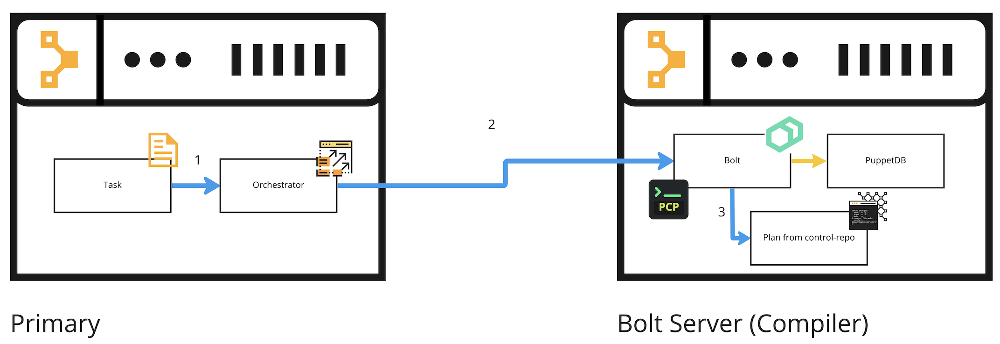

# puppet_bolt_server

This module installs and configures Bolt to use a local PuppetDB and the PCP transport

## Table of Contents

1. [Description](#description)
1. [Setup - The basics of getting started with puppet_bolt_server](#setup)
    * [What puppet_bolt_server affects](#what-puppet_bolt_server-affects)
1. [Installation - Step by step guide](#installation)
1. [Usage - Configuration options and additional functionality](#usage)
1. [Limitations - OS compatibility, etc.](#limitations)

## Description

This module aims to configure a dedicated Puppet Enterprise compiler to become a Bolt Server, with the intention of offloading plan execution from Orchestrator on the Primary server, to Bolt on the Bolt server. A compiler is ideal because it already has access to Puppet Enterprise, code manager, and its local PuppetDB.

## Setup

### What puppet_bolt_server affects

The `puppet_bolt_server` module will perform the following activities:

* Install Bolt on the node.
* Create the `/root/.puppetlabs/etc/bolt/bolt-defaults.yaml` file with custom configuration to:
    * Use the PCP transport
    * Use the local PuppetDB for queries
    * Consume a Puppet token

## Installation

**Quickstart:** Configure the `puppet_bolt_server` using the PE Console

This setup will help you to quickly configure the `puppet_bolt_server` in your existing PE server.

1. Add the [puppetlabs-puppet_bolt_server](https://github.com/puppetlabs/puppetlabs-puppet_bolt_server) to your control repo.
1. Add a new Node Group from the PE Console

```
  Parent name: PE Infrastructure
  Group name: Bolt Server
  Environment: production
```

1. Add the class `puppet_bolt_server` to the Bolt Sever group created in the step above.
1. Add your compiler dedicated to running Bolt to the group using the Rules tab. Note that this compiler should not be in the compiler pool for catalog compilation.
1. Add your puppet token (Sensitive string) in the Configuration data tab

    1. We recommend you create a service user inside PE RBAC and choose an appropriate lifetime for its token.
    1. Generate a token with a lifetime of 1 year: `puppet access login --lifetime 1y`

```
  Class: puppet_bolt_server
  Parameter: puppet_token
  Value: 'insert-your-puppet-token-here'
```

1. Commit your changes.
1. Run Puppet on this Node Group.

## Usage

After Puppet applies the changes described in the installation steps, you should end up with the following files in the Bolt server:

- `/root/.puppetlabs/etc/bolt/bolt-defaults.yaml`
- `/root/.puppetlabs/token`

To test that everything was configured properly, we can run any Bolt plan that runs a PuppetDB query, for example:

```
# /root/Projects/local_plan/plans/test.pp

plan local_plan::test(
){
  $query_results = puppetdb_query("nodes[]{}")
  out::message("Hello world from the Bolt Server, query results: ${query_results}")
}
```

Run the Bolt plan:

`bolt plan run local_plan::test`

We should see the PuppetDB query results in the terminal, and if we inspect the `puppetdb-access.log` there should be a log with a call to the local PuppetDB with a 200 Ok HTTP status:

```
$ less /var/log/puppetlabs/puppetdb/puppetdb-access.log

127.0.0.1 - - [01/Nov/2022:15:56:21 +0000] "POST /pdb/query/v4 HTTP/1.1" 200 1793 "-" "HTTPClient/1.0 (2.8.3, ruby 2.7.6 (2022-04-12))" 99 21 -
```

### Running a Plan via taskplan from the Primary Server

We recommend to install the [`taskplan` module](https://forge.puppet.com/modules/reidmv/taskplan).

- The intended use for `taskplan` is to run Plans in the Bolt server, especifically by telling it to run it on a target node, in this case, our Bolt server.

**Running a Plan on the Bolt Server**

This is an overview of the internal process when you offload the Plan execution from the PE Primary server to the Bolt server:

1. The request to run the Task on the Bolt server is submitted to Orchestrator
1. Orchestrator runs the Task on the Bolt server
1. The task runs the Plan on the Bolt server



**Example 1**

In this example, we will use `bolt task run` to run the `taskplan` Task on the Bolt server.

Required parameters:

- Choose one of your existing basic Plans, or create one that receives a parameter, `message` in this case.
- Use the certname of your Bolt Server

From the PE Primary server CLI we will run:

```
puppet task run taskplan --params '{"plan":"a-test-plan", "params":{"message": "Hello world!"}, "debug":true}' -n insert-here-the-bolt-server-certname
```

This will trigger a Task run (`taskplan`) on the Bolt Server and the task will run the Plan we specified in the parameters directly on the Bolt server. While all this process sounds tedious and cumbersome, it's a clever way to offload the Plan execution from the PE primary to the Bolt server, the result is a minimum resource consumption on the Primary Server.

**Example 2**

Now in this 2nd example, we will use the Orchestrator API directly to trigger a Task run. This can be done from any system that has the Puppet RBAC token and has connectivity to the PE primary on port 8143.

We will run the `taskplan` task again, targetting our Bolt server. Here is an example you can use:

```
# test_params.json

{
  "environment" : "production",
  "task" : "taskplan",
  "params" : {
    "plan" : "a-test-plan",
    "params" : { "message": "Hello world!" },
    "debug" : true
  },
  "scope" : {
    "nodes" : ["insert-here-the-bolt-server-certname"]
  }
}
```

Make sure to change the `params.plan`, `params.params`, and the `scope.nodes` to your own case.

Now to run the task we will use `curl`:

```
auth_header="X-Authentication: $(puppet-access show)"
uri="https://$(puppet config print server):8143/orchestrator/v1/command/task"

curl -d "@test_params.json" --insecure --header "$auth_header" "$uri"
```

## Limitations

- This first version of the `puppet_bolt_server` has been tested only on RHEL 7 and 8 based systems.
- Requires Puppet ">= 6.21.0 < 8.0.0"
- **Warning** There is no rate limit to run Plans, we tested this module in our lab and it successfully handled up to 200 concurrent plans with a Bolt Server with the following specs:
    - 8 GB RAM
    - CPU Intel Xeon Platinum 8000 series, 4-cores

